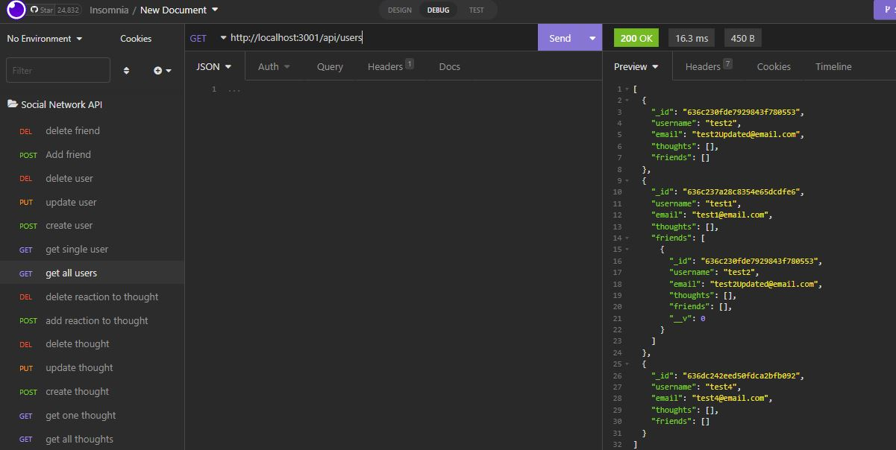

# Social-Network-API

## Table of contents

- [General info](#general-info)
- [Technologies](#technologies)
- [App](#app)
- [Contact me](#contact-me)

## General info

This is an API for a social network web application where users can share their thoughts, react to friends’ thoughts, and create a friend list.

## Technologies

Project is created with:

- JavaScript
- Express
- mongoose
- validator

## App

- [Walkthrough Video](https://watch.screencastify.com/v/LxeC7hiyYh8mHxoh6kKX)

## Contact me

- [Email: mel.chavez.code@gmail.com](mailto:mel.chavez.code@gmail.com)
- [GitHub: 12MChavez](https://github.com/12MChavez)
